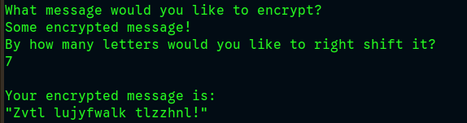

# caesar-cipher
An implementation of the Caesar cipher that takes in a string and the shift factor and then outputs the modified string using a right shift.

### Check it out yourself

If you've got Ruby installed on your local machine, you can either

- Copy the contents of the script, `caesar_cipher.rb`, and paste it into the Interactive Ruby Shell (IRB) from the command line.

OR

- Run the script, using
    ```
    ruby caesar_cipher.rb
    ```
    from your command line.

Otherwise, you can just paste the contents into any Ruby REPL online.

### Screenshot

